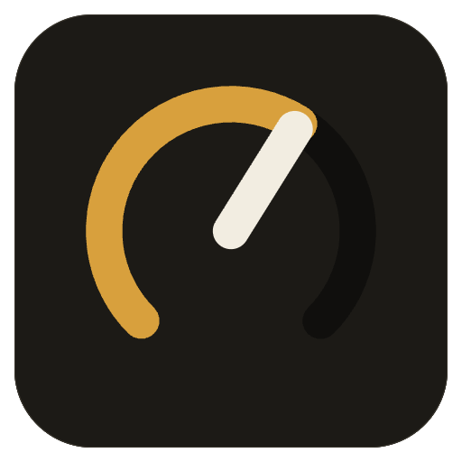
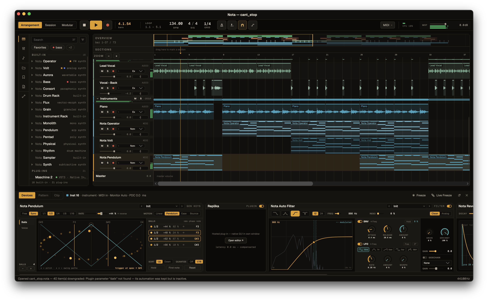

<p align="center">
  
</p>

<h1 align="center">Nota</h1>

<p align="center">
  <a href="https://github.com/nota-daw/nota/releases/latest"></a>
  <a href="https://github.com/nota-daw/nota/actions/workflows/release.yml"></a>
  <a href="https://github.com/nota-daw/nota/releases"></a>
  <a href="LICENSES/"></a>
  
  <a href="https://t.me/notadaw"></a>
</p>

> **Disclaimer.** Nota is first and foremost an **AI-driven** product — the bulk of it
> was developed with AI assistance. It started as a tool I built for myself, and was only
> later opened up as open source. Guided and shaped throughout by me,
> **Egor Khindikaynen** aka **Ambertape** ([music](https://soundcloud.com/ambertape)).

Nota is a cross-platform digital audio workstation (DAW). The audio engine and DSP
are a portable C++20 core; the UI is Avalonia (.NET). Plugin hosting (VST3, plus AU
on macOS) runs through JUCE, isolated in its own module so the engine core stays
JUCE-free.



- **UI / app:** .NET 10, Avalonia 12 (C#) — `src/managed`
- **Engine / DSP:** C++20, built with CMake + Ninja — `src/native/nota.engine`
- **Audio backends:** CoreAudio (macOS), WASAPI (Windows), PulseAudio/ALSA (Linux, via miniaudio)
- **MIDI:** CoreMIDI (macOS), RtMidi — WinMM (Windows) / ALSA (Linux)

**Documentation:** [`ARCHITECTURE.md`](ARCHITECTURE.md) — how the engine, the C ABI and the
app fit together · [`CONTRIBUTING.md`](CONTRIBUTING.md) — contributing, licensing your
work, and the real-time rules · [`LICENSES/`](LICENSES/) — license terms and the
dependency register.

The native engine is built separately by CMake, and the app's project copies the
right artifact (`libnota_engine.dylib` / `nota_engine.dll` / `libnota_engine.so` +
`nota-scanworker`) next to the managed binary for P/Invoke.

## Features

A quick digest — see [`FEATURES.md`](FEATURES.md) for the full, categorised list.

- **Three views** — a linear **Arrangement** timeline, a clip-launching **Session** grid
  (material moves freely between them), and a **Modular** signal-graph editor with **CV
  modulation** (LFO / envelope follower / MIDI→CV / ADSR / Macro / Math, patched with
  cables onto any parameter).
- **Tracks & mixer** — audio / MIDI / return / master / nestable **group** tracks; sends
  and returns; MIDI routing between tracks; peak/RMS + true-peak metering; per-track device
  chains.
- **MIDI editing** — piano roll (draw/move/stretch, quantize, velocity, live edits as one
  undo step); input from a MIDI keyboard, the computer keyboard, or a **gamepad** (macOS);
  **MIDI file import** (drag a `.mid` in); **audio→MIDI** (melody / harmony / drums / slice).
- **Audio** — recording (inputs and internal buses), WAV/AIFF/FLAC/MP3 import, clip
  editing with fades, gain and a per-clip **ADSR**, and **warp / time-stretch** (Complex /
  Complex Pro).
- **~35 built-in devices** — synths (subtractive, wavetable, FM, granular, physical,
  drum-machine and more), a full effects suite (EQ, dynamics, reverb/delay, saturation,
  limiting, utility), MIDI effects (arp, scale, chord, …), and Instrument / Drum / Audio
  Effect **racks** with macros.
- **Plugin hosting** — VST3 everywhere, AU on macOS: native GUIs, state save/restore, PDC,
  transport sync; parameters are automatable and MIDI-learnable.
- **Downloads** — install open-source VST3 plugins (Surge XT, Dexed, Dragonfly Reverb …)
  in one click from Settings, straight from the
  [Nota plugin registry](https://github.com/nota-daw/nota-plugins-registry).
- **Browser previews** — hear presets, drum kits and effects before loading them, and
  audition samples in the Files tab's player.
- **Automation & MIDI Learn** — draw/record automation on any parameter; map hardware
  controllers to almost anything.
- **Export** — master and stems to WAV (pcm16/pcm24/float32), true-peak normalize, dither,
  bit-identical chunked rendering.
- **AI control (MCP)** — an optional loopback MCP server lets Claude drive the open project
  (off by default).
- **Cross-platform** — macOS, Windows and Linux, for both x64 and arm64.

## Nota plugin registry

Nota now has its own plugin registry —
**[nota-daw/nota-plugins-registry](https://github.com/nota-daw/nota-plugins-registry)**.
It is the list of open-source VST3 plugins that Nota installs from **Settings → Downloads**:
one JSON manifest per plugin, pinned to a release asset's size and sha256, and published as a
single `index.json`.

**Writing a plugin?** Add it to the registry so every Nota user can install it in one click.
The registry's [README](https://github.com/nota-daw/nota-plugins-registry#readme) explains what
gets in (an OSI license, a VST3 in an archive rather than an installer, stable release tags)
and how to add a plugin or a new version — then open a pull request there.

## Prerequisites

Common to every platform:

- **.NET SDK 10**
- **CMake ≥ 3.24** and **Ninja**
- A **C++20** compiler

Per platform, additionally:

| OS | Toolchain | Native dev packages |
|----|-----------|---------------------|
| **macOS** | Xcode command-line tools | (CoreAudio/CoreMIDI ship with the OS) |
| **Windows** | Visual Studio 2022 (MSVC + Windows SDK); [Inno Setup](https://jrsoftware.org/isinfo.php) 6.3+ for the installer | (WASAPI/WinMM ship with the OS) |
| **Linux** | `build-essential` | `libasound2-dev libx11-dev libxext-dev libxrandr-dev libxinerama-dev libxcursor-dev libfreetype6-dev libfontconfig1-dev` |

On Debian/Ubuntu, install the Linux native deps with:

```bash
sudo apt install build-essential cmake ninja-build libasound2-dev libx11-dev libxext-dev libxrandr-dev libxinerama-dev libxcursor-dev libfreetype6-dev libfontconfig1-dev
```

> miniaudio runtime-links PulseAudio/ALSA (dlopen), so `libpulse`/`libasound` aren't
> needed at link time — only `libasound2-dev` (for RtMidi). JUCE (plugin hosting)
> pulls the X11/freetype/fontconfig libs.

## Build & run (development)

**Don't forget the submodules.** JUCE (plugin hosting) lives in a git submodule at
`src/native/nota.engine/vendor/JUCE`, and the native build fails without it. Clone with
submodules:

```bash
git clone --recurse-submodules https://github.com/nota-daw/nota.git
```

or, in a checkout you already have (also after a pull that moves the submodule):

```bash
git submodule update --init --recursive
```

Each platform has a build script that compiles the native engine, builds the managed
app, and runs the smoke test. Then run the app with `dotnet run`.

**macOS**
```bash
scripts/build.sh            # native (universal arm64+x86_64) + managed + smoke
dotnet run --project src/managed/Nota.App
```

**Windows** — from a *Developer PowerShell for VS 2022*:
```powershell
pwsh scripts/build-win.ps1  # native (x64/WASAPI) + managed + smoke
dotnet run --project src/managed/Nota.App
```

**Linux**
```bash
scripts/build-linux.sh      # native (PulseAudio/ALSA + RtMidi/ALSA) + managed + smoke
dotnet run --project src/managed/Nota.App
```

To build only the native engine directly:

```bash
cmake -G Ninja -S src/native/nota.engine -B src/native/nota.engine/build -DCMAKE_BUILD_TYPE=Release
cmake --build src/native/nota.engine/build
```

> On memory-constrained machines/containers, cap parallelism so the large JUCE
> translation units don't get OOM-killed: `export CMAKE_BUILD_PARALLEL_LEVEL=2`.

## Packaging (distributables)

All scripts write to `dist/`.

**macOS** — `.app` and one `.dmg` per arch (an Apple Silicon host builds both):
```bash
scripts/bundle-mac.sh              # -> /Applications/Nota.app (ad-hoc signed)
scripts/package-dmg.sh arm64       # -> dist/Nota-<version>-arm64.dmg
scripts/package-dmg.sh x86_64      # -> dist/Nota-<version>-x86_64.dmg
```
The installer window's background comes from `assets/macos/dmg-background.png`
(660×400) and its `@2x` (1320×800); both are required.

**Windows** — Inno Setup installer (x64 / arm64; one x64 host cross-builds both):
```powershell
pwsh scripts/package-win.ps1 x64     # -> dist/Nota-Setup-<version>-x64.exe
pwsh scripts/package-win.ps1 arm64   # -> dist/Nota-Setup-<version>-arm64.exe
```

**Linux** — portable AppImage (built for the host arch; `appimagetool` auto-downloaded):
```bash
scripts/package-linux.sh       # -> dist/Nota-<version>-<arch>.AppImage
```

### Building a Linux AppImage from macOS/Windows

The native `.so` can't be cross-compiled off Linux, so build it inside a Linux
container. The AppImage is built for the container's architecture: on Apple Silicon,
Docker runs an **arm64** container by default, so `--platform linux/amd64` is what
forces an **x86_64** build (via QEMU emulation — correct but noticeably slower).

Keep each command on one line when copying — line-continuation backslashes get
dropped by some terminals and break the `apt-get` package list.

**x86_64 (linux-x64)** → `dist/Nota-<version>-x86_64.AppImage`:

```bash
docker run --rm --platform linux/amd64 -e CMAKE_BUILD_PARALLEL_LEVEL=2 -v "$PWD":/src -w /src mcr.microsoft.com/dotnet/sdk:10.0 bash -c 'apt-get update -qq && apt-get install -y --no-install-recommends cmake ninja-build build-essential curl ca-certificates file squashfs-tools libasound2-dev libx11-dev libxext-dev libxrandr-dev libxinerama-dev libxcursor-dev libfreetype6-dev libfontconfig1-dev && scripts/package-linux.sh'
```

**arm64 (linux-arm64)** → `dist/Nota-<version>-aarch64.AppImage` (drop `--platform`; native on Apple Silicon, fast):

```bash
docker run --rm -e CMAKE_BUILD_PARALLEL_LEVEL=2 -v "$PWD":/src -w /src mcr.microsoft.com/dotnet/sdk:10.0 bash -c 'apt-get update -qq && apt-get install -y --no-install-recommends cmake ninja-build build-essential curl ca-certificates file squashfs-tools libasound2-dev libx11-dev libxext-dev libxrandr-dev libxinerama-dev libxcursor-dev libfreetype6-dev libfontconfig1-dev && scripts/package-linux.sh'
```

## License

Licensed under **AGPL-3.0-only** — see [`LICENSES/`](LICENSES/)
for the terms, and [`LICENSES/third-party.md`](LICENSES/third-party.md) for the
dependency register.

Nota links JUCE, which is AGPLv3, so the open build is AGPL rather than GPL — see
[`LICENSES/README.md`](LICENSES/README.md#why-agpl-and-not-gpl).
