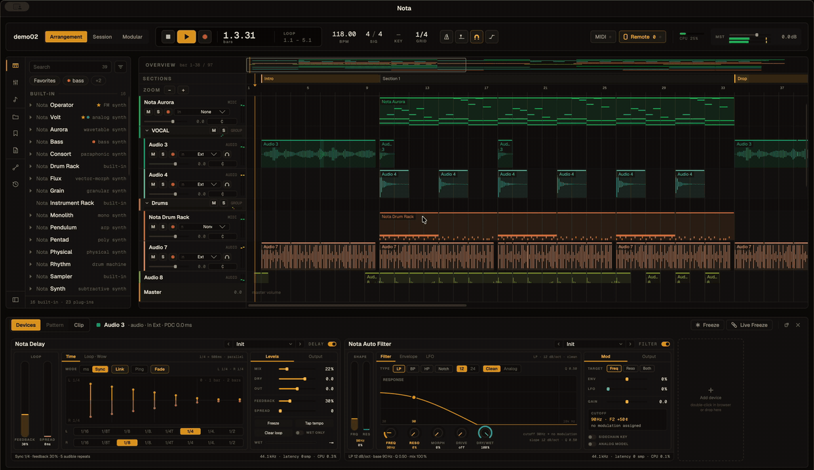
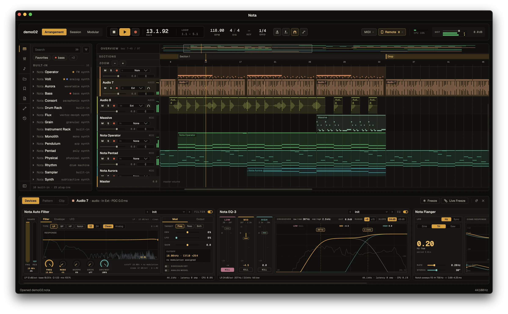
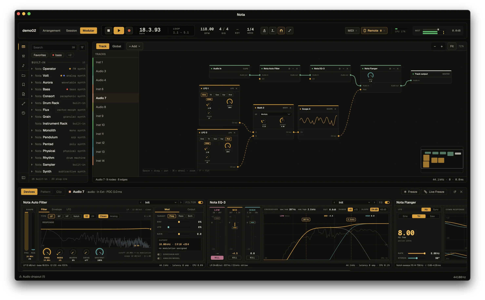
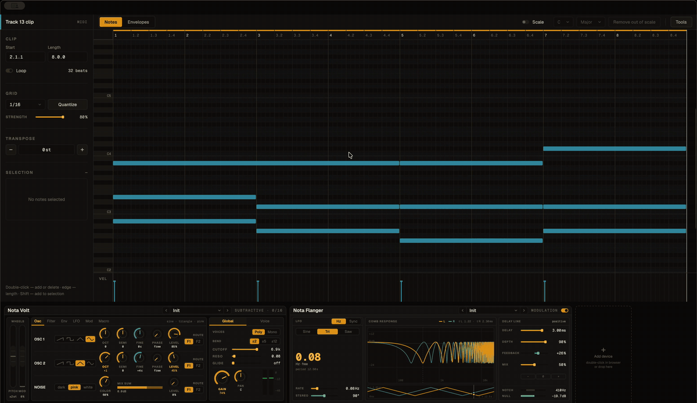
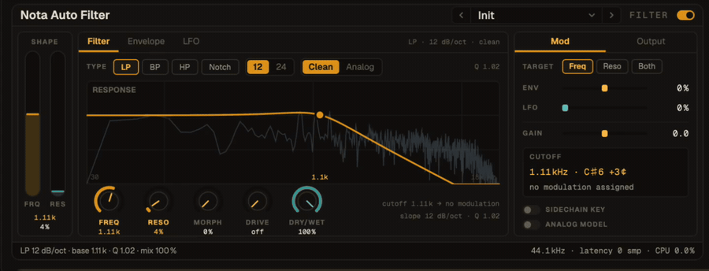
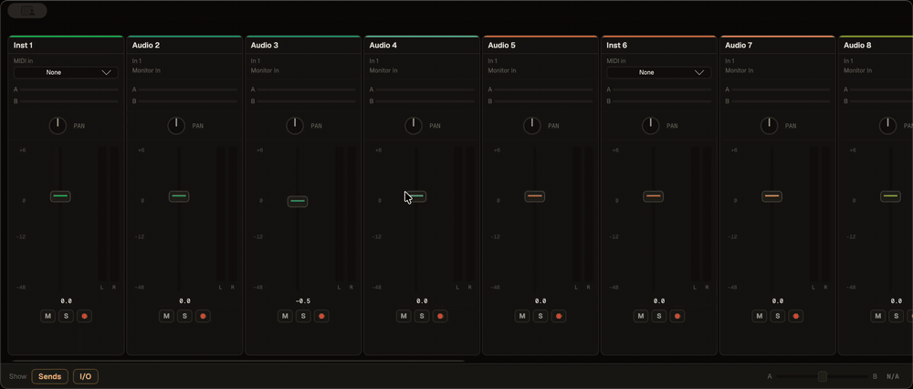
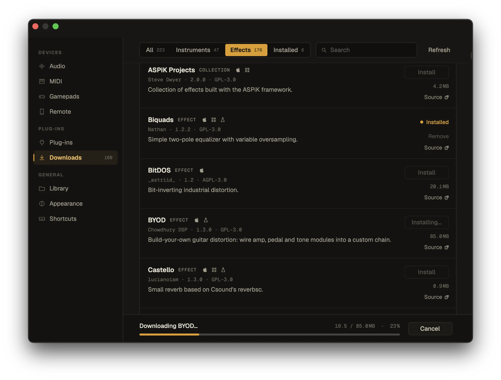
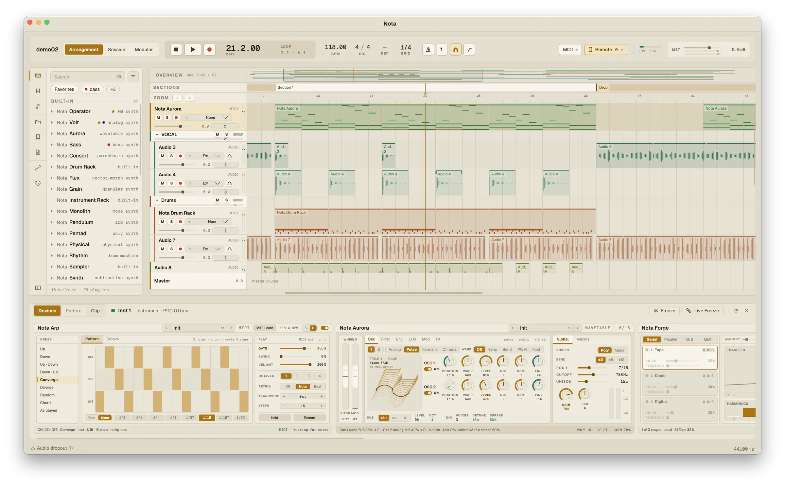

<p align="center">
  
</p>

<h1 align="center">Nota</h1>

<p align="center">
  <b>A free music studio for macOS, Windows and Linux.</b><br>
  No subscription, no account, no feature tiers — just open it and make music.
</p>

<p align="center">
  <a href="https://github.com/nota-daw/nota/releases/latest"></a>
  &nbsp;
  <a href="https://nota-daw.github.io/nota-site/"></a>
</p>

<p align="center">
  <a href="https://github.com/nota-daw/nota/releases/latest"></a>
  <a href="https://github.com/nota-daw/nota/actions/workflows/release.yml"></a>
  <a href="https://github.com/nota-daw/nota/releases"></a>
  <a href="LICENSES/"></a>
  
</p>



## Why Nota

- **Free, for good.** Open source, no paid edition, no "upgrade to unlock".
- **Arrange and jam.** A linear **Arrangement** timeline and a clip-launching **Session**
  grid, with material moving freely between them — plus a **Modular** view for patching
  modulation by cable.
- **A full kit out of the box.** ~35 built-in instruments and effects: subtractive,
  wavetable, FM, granular and physical-modelling synths, a drum machine, EQ, compressors,
  reverbs, delays, saturation, arpeggiator, chord and scale tools, racks with macros.
- **Your plugins too.** VST3 on every platform, Audio Units on macOS. Popular free plugins
  (Surge XT, Dexed, Dragonfly Reverb …) install in one click from Settings.
- **Your phone is a controller.** Scan a QR code and play pads, keys and an XY pad, or ride
  the mixer — over Wi-Fi or USB, nothing to install.
- **Works where you do.** The same app on macOS, Windows and Linux, on Intel/AMD and ARM.

## Screenshots

<table>
  <tr>
    <td width="50%"><br><sub><b>Arrangement</b> — the song, with the selected track's devices below</sub></td>
    <td width="50%"><br><sub><b>Modular</b> — patch LFOs and modulators onto any parameter</sub></td>
  </tr>
  <tr>
    <td width="50%"><br><sub><b>Piano roll</b> — draw, then arpeggiate, strum or ornament in one click</sub></td>
    <td width="50%"><br><sub><b>Built-in devices</b> — every one draws what it does to the sound</sub></td>
  </tr>
  <tr>
    <td width="50%"><br><sub><b>Mixer</b> — faders, sends and live meters</sub></td>
    <td width="50%"><br><sub><b>Downloads</b> — 200+ free open-source plugins, one click to install</sub></td>
  </tr>
  <tr>
    <td colspan="2"><br><sub>…and a light theme, for daytime sessions.</sub></td>
  </tr>
</table>

## Features

A quick digest — see [`FEATURES.md`](FEATURES.md) for the full, categorised list.

- **Three views** — **Arrangement** timeline, **Session** clip grid, and a **Modular**
  signal-graph editor with **CV modulation** (LFO / envelope follower / MIDI→CV / ADSR /
  Macro / Math, patched onto any parameter).
- **Tracks & mixer** — audio, MIDI, group (nestable), return and master tracks; sends;
  MIDI routing between tracks; peak/RMS and true-peak meters.
- **MIDI** — piano roll with quantize and velocity; play from a MIDI keyboard, the computer
  keyboard, a **gamepad** (macOS) or your **phone**; drag in `.mid` files; turn audio into
  MIDI (melody / harmony / drums / slice).
- **Audio** — record from inputs and internal buses; import WAV/AIFF/FLAC/MP3; fades, gain
  and per-clip envelopes; **warp / time-stretch**.
- **Automation & MIDI Learn** — draw or record automation on any parameter; map hardware
  knobs to almost anything.
- **Browser** — preview presets, drum kits, effects and samples before you load them.
- **Version history** — every save is kept; go back to any earlier version of a song, or
  branch off from it.
- **Export** — the master or stems to WAV (16/24-bit or 32-bit float), with true-peak
  normalize and dither.
- **AI control (optional)** — a local MCP server lets an AI assistant such as Claude work
  in the open project. Off by default.

## Install

Download the file for your system from the
**[latest release](https://github.com/nota-daw/nota/releases/latest)**:

| System | File | Notes |
|---|---|---|
| **macOS 13+**, Apple Silicon (M1 and later) | `Nota-<version>-arm64.dmg` | |
| **macOS 13+**, Intel | `Nota-<version>-x86_64.dmg` | |
| **Windows 10/11**, most PCs | `Nota-Setup-<version>-x64.exe` | |
| **Windows 11** on ARM | `Nota-Setup-<version>-arm64.exe` | |
| **Linux**, most PCs | `Nota-<version>-x86_64.AppImage` | |
| **Linux** on ARM | `Nota-<version>-aarch64.AppImage` | |

### First launch

Nota isn't signed with a paid Apple or Microsoft certificate yet, so the system asks you to
confirm the first time:

- **macOS** — open the `.dmg` and drag Nota to Applications. If macOS says it "can't verify"
  Nota, open **System Settings → Privacy & Security**, scroll down and click
  **Open Anyway**. (Or, in Terminal: `xattr -dr com.apple.quarantine /Applications/Nota.app`.)
- **Windows** — if SmartScreen shows "Windows protected your PC", click **More info →
  Run anyway**.
- **Linux** — make the AppImage executable (`chmod +x Nota-*.AppImage`, or Properties →
  Permissions in your file manager) and run it.

Nota checks for updates itself and shows what's new after each update.

## Status

Nota is young and moving fast — new releases come out every week or so (see the
[changelog](CHANGELOG.md)). It's already used to make real music, but expect rough edges.
Found a bug or missing something? [Open an issue](https://github.com/nota-daw/nota/issues) —
every report gets read.

## For plugin developers

Nota has its own plugin registry —
**[nota-daw/nota-plugins-registry](https://github.com/nota-daw/nota-plugins-registry)** —
the list of open-source VST3 plugins that Nota installs from **Settings → Downloads**.
Add yours with a pull request and every Nota user can install it in one click; the
registry's [README](https://github.com/nota-daw/nota-plugins-registry#readme) explains
what gets in and how.

## Building from source

The audio engine and DSP are a portable C++20 core; the UI is .NET 10 / Avalonia 12 (C#);
plugin hosting runs through JUCE, isolated in its own module so the engine core stays
JUCE-free.

```bash
git clone --recurse-submodules https://github.com/nota-daw/nota.git
cd nota
scripts/build.sh            # macOS; scripts/build-linux.sh on Linux, scripts/build-win.ps1 on Windows
dotnet run --project src/managed/Nota.App
```

- [`BUILD.md`](BUILD.md) — prerequisites per platform, manual builds, packaging installers
  and AppImages.
- [`ARCHITECTURE.md`](ARCHITECTURE.md) — how the engine, the C ABI and the app fit together.
- [`CONTRIBUTING.md`](CONTRIBUTING.md) — contributing, licensing your work, and the
  real-time rules.

## About

Nota is made by **Egor Khindikaynen** aka **Ambertape**
([music](https://soundcloud.com/ambertape)). It started as a tool I built for my own
music and was later opened up as open source. Most of the code was written with AI
assistance, with every design decision, the sound and the workflow guided and shaped
by me.

## License

Licensed under **AGPL-3.0-only** — see [`LICENSES/`](LICENSES/) for the terms, and
[`LICENSES/third-party.md`](LICENSES/third-party.md) for the dependency register.

Nota links JUCE, which is AGPLv3, so the open build is AGPL rather than GPL — see
[`LICENSES/README.md`](LICENSES/README.md#why-agpl-and-not-gpl).
